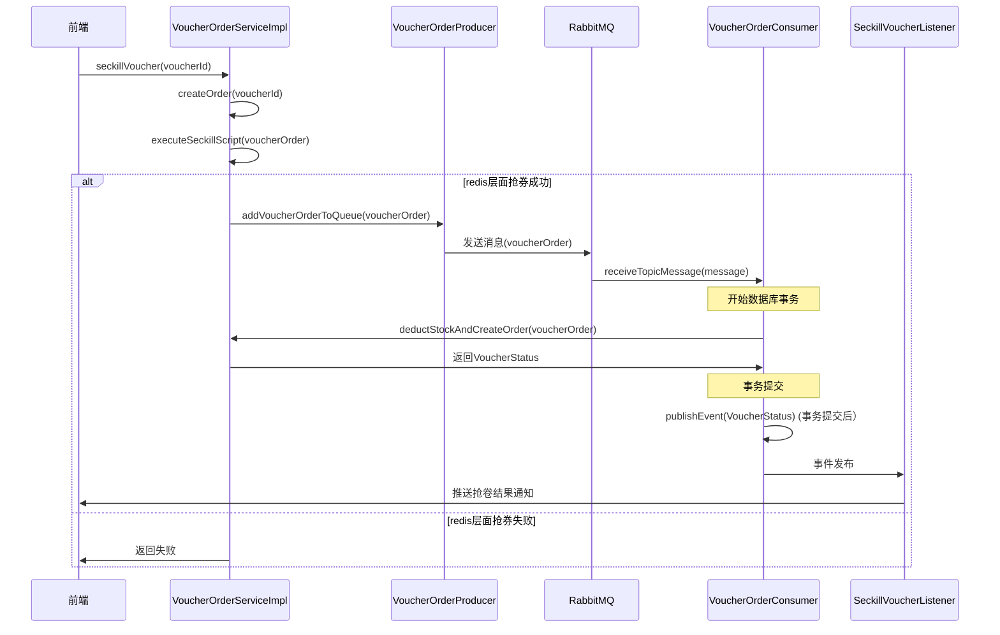

# Dian Ping

## 功能

### 秒杀优惠券

业务流程:

代码工作流: 

1. 这个工作流程适合秒杀订单功能吗?
  答: 不适合, 在极端情况下redis无法避免数据丢失, 当前工作流程依赖redis.

2. 是否有可能出现MQ消息堆积的情况? 
  答: 不可能. 因为在发送消息到MQ之前用lua脚本做了库存预检和扣除. 实际发送消息的数量 = 秒杀优惠券的数量, 而秒杀优惠券数量往往较少.

3. 如果秒杀优惠券数量很多, 怎么防止消息堆积?
  答: 造成消息堆积的原因主要是消费者消费速率小于生产者生产速率. 可以采用以下方案解决:

   + 增加消费者的数量
   + 对请求接口做限流, 限制每秒最大请求速率

4. 整个流程在极端情况下可能出现redis数据和数据库数据不一致的问题. 怎么处理这个问题?
  答: 这个功能出现redis数据和数据库数据不一致的情况分两种:

  1. redis挂了, MQ正常. 此时会丢失一些抢卷成功扣减的库存,  造成$redis优惠券库存 > 数据库优惠券库存$

  2. MQ挂了, redis正常. 此时抢卷功能仍然能够使用, 但$redis优惠券库存 < 数据库优惠券库存$

​		针对第一种情况: 进行人工干预,  先禁止程序对外服务, 等待MQ消息全部消费完毕, 同步数据库优惠券库存到redis优惠券库存.在开放程序服务

​		针对第二种情况: 开启一个定时任务, 定时检查redis优惠券库存是否和数据库库存一致, 如果不一致, 以redis中的数据为准做数据补偿